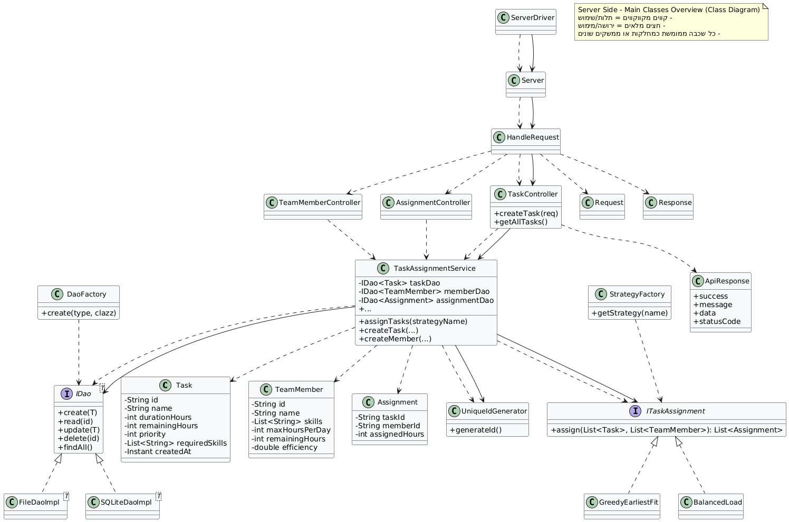
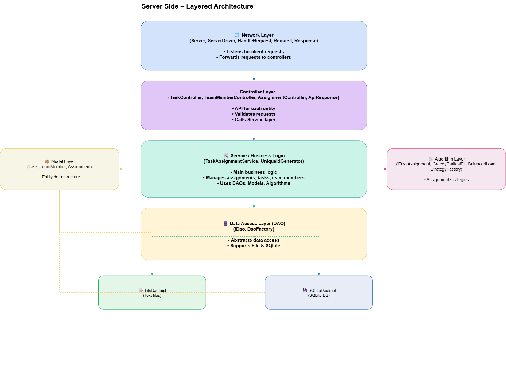

# SmartSchedulerApp

A modular, extensible, and visually intuitive platform for smart team task assignment and management.  
Built with JavaFX (Client) and Java (Server), this project demonstrates clean layered architecture, flexible data access (DB & Files), and pluggable assignment algorithms.

---

## 📸 **Project Overview**

- **Client:** JavaFX desktop application (FXML-based, modular).
- **Server:** Java backend with layered architecture, REST-like API over custom protocol.
- **Algorithm Module:** Contains the models, algorithms, and core logic, packaged as a JAR used by the server.

---
## Demo Video

[Watch the demo video](docs/demo.mp4)

## 🏗️ **Architecture**

### Server Side

|  |
|:--:|
| *Main Classes Overview* |

|  |
|:--:|
| *Layered Architecture* |

#### **Layers:**
- **Network Layer:** Receives client requests, dispatches to controllers.
- **Controller Layer:** Per-entity API, validation, forwarding to service.
- **Service / Business Logic:** Core algorithms, task/member/assignment management.
- **DAO Layer:** Data access abstraction — supports both file and SQLite storage.
- **Model & Algorithm Layer:** Core entities and assignment strategies.

### Client Side

|  |
|:-----------------------------------------------:|
|           *Client Component Diagram*            |

|  |
|:---------------------------------------------:|
|              *UX Navigation Map*              |

#### **Structure:**
- **FXML Views:** All UI screens and cards (tasks, members, assignments, stats, home, forms, sidebar).
- **Controllers:** Per-view logic and data binding.
- **Utils:** Helper classes for navigation, skill rendering, JSON handling, etc.
- **NetworkClient:** Handles communication with the server.

---

## 🧠 **Key Features**

- **Modular Layered Design:** Easily swap out data sources, algorithms, or UI components.
- **Flexible Assignment Algorithms:** Choose between Greedy, BalancedLoad, or custom strategies.
- **Modern JavaFX UI:** Clean, FXML-based, modular, and extendable.
- **Persistent Storage:** Supports both SQLite DB and file-based storage (configurable).
- **Clear UX Flow:** Easy navigation between core modules (tasks, members, assignments, stats).

---

## 🧪 **Testing & Quality**

This project includes **comprehensive JUnit test suites** for all critical components:

### **Service Layer & Logic**
- `TaskAssignmentServiceTest` – Thoroughly tests assignment logic for both File and SQLite DAOs.
- `TestDataGenerator` – Quickly creates random but valid test data for integration/stress tests.

### **DAO Integration & Database**
- `DaoImplIntegrationTest`, `DaoInsertDemoDataTest` – Validates CRUD operations and data isolation for both persistence types.
- `DBInitAndPopulateTest` – Ensures clean DB state and demo population routines.

### **Full Flow & Integration**
- `IntegrationFullFlowTest` – End-to-end test: simulates real client-server-database flows.
- `NetworkEndToEndTest` – Verifies communication and results over actual network calls.

### **Network & Protocol Robustness**
- `NetworkEdgeCasesTest` – Network drops, invalid ports, timeouts, large payloads, multiple requests per connection.
- `ConcurrencyAndRobustnessTest` – Simulates concurrent users, race conditions, thread safety.

### **Validation & Error Handling**
- `ValidationAndErrorTest` – Confirms that all business and input validation is enforced, and error responses are consistent and safe.

🚀 **Getting Started**

**Prerequisites**

- Java 17+ (client and server)
- [JavaFX SDK](https://openjfx.io/) (client)
- [SQLite JDBC Driver](https://github.com/xerial/sqlite-jdbc) (if using SQLite backend)


**How to run tests:**
```bash
./gradlew test
# Or in your IDE: Right click > Run Tests on test folders

git clone https://github.com/your-username/SmartSchedulerApp.git
cd SmartSchedulerApp

# Build AlgorithmModule (JAR)
cd AlgorithmModule
./gradlew build

# Build & run Server
cd ../SmartSchedulerApp
./gradlew build
java -jar build/libs/SmartSchedulerApp.jar

# Build & run Client (JavaFX)
cd ../SmartSchedulerUI
./gradlew build
java --module-path <path-to-javafx-lib> --add-modules javafx.controls,javafx.fxml -jar build/libs/SmartSchedulerUI.jar

```

## ⚙️ **Configuration**

- **Switch between File and SQLite backend:**  
  Edit the configuration file `config.properties` or environment variable to set DAO type (`file` or `sqlite`).

- **Add new assignment algorithms:**  
  Implement `ITaskAssignment` interface and register in `StrategyFactory`.

- **Custom UI:**  
  Modify or add FXML and Controller classes as needed.

## 📦 **Tech Stack**

- **Java 17+**
- **JavaFX 17+** (FXML)
- **SQLite / File persistence**
- **JUnit** (unit tests for logic and DAO)
- **Gradle** (build automation)

---

## 📈 **Extending / Contributing**

- **Add a new algorithm:**  
  Implement `ITaskAssignment`, add to `StrategyFactory`.
- **UI Themes:**  
  Replace FXML/CSS for custom look.
- **REST/HTTP support:**  
  Adapt the server network layer for HTTP (optional).

**PRs and issues are welcome!**

---

## 🙏 **Credits**

- Initial design and implementation: Yehonatan Ravoach
- Inspired by real-world scheduling challenges in project management


---

## 📚 **References**

- [JavaFX Documentation](https://openjfx.io/)
- [SQLite JDBC](https://github.com/xerial/sqlite-jdbc)
- [PlantUML](https://plantuml.com/)


